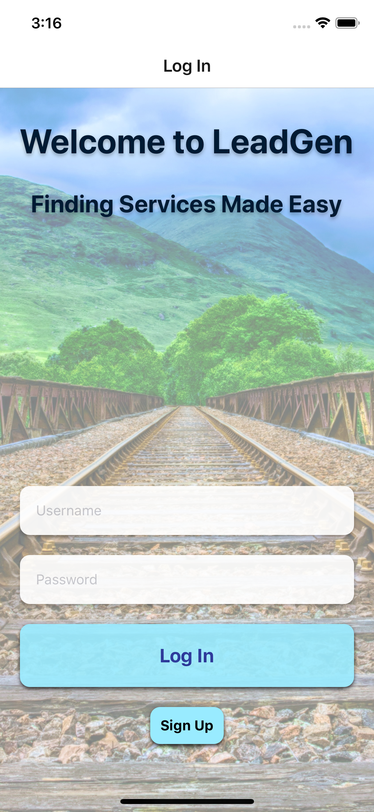

# LEADGEN

## A React-Native chatting mobile app

### LEADGEN is powered by React-Native/Node.js/Express.js/MySQL/Socket.io

    
    
    

####About
- **LeadGen** is a cross platform mobile application that is intended to help users find and chat with potential contractors and services. It is also an example of a functioning chatting application with live chatrooms.

    
    

####Software
- **React-Native** built front-end, supporting cross platform
- **Node.js** and **Express.js** powered server on the back-end along with Node.js middleware
- **MySQL** and **Sequelize** database used to store user profile information
- **Socket.io** websocket used to power and create unique chat rooms
- **FireBase** used to store and retrieve user messages

####Author
- **Sasank Ganapathiraju**